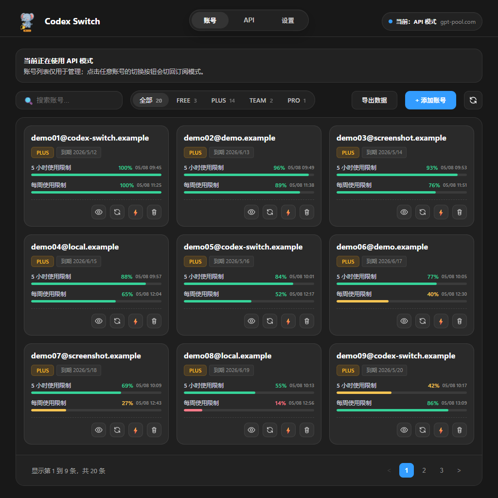

# Codex Switch

[简体中文](./README.md)

Codex Switch is a local desktop tool for managing multiple Codex subscription accounts and switching between subscription accounts and OpenAI-compatible API mode.

It brings account switching, API configuration, session sync, proxy controls, and update checks into one interface, reducing the need to edit settings manually.

## Download

Download the latest version from [GitHub Releases](https://github.com/wen495033653/codex-switch/releases). See the [code signing policy](./CODE_SIGNING.md) for release signing details.

## Features

### Account Management

- Manage multiple Codex subscription accounts and switch between them quickly.
- Import accounts with OAuth, `refresh_token`, or JSON files.
- View account status, usage information, and refresh time.
- Import, export, delete, and rename accounts for long-term account maintenance.

### API Mode

- Configure an OpenAI-compatible API profile.
- Accept common Base URL input formats and normalize them into a usable endpoint.
- Hide or reveal the API Key when needed.
- Switch between subscription accounts and API mode with one action.

### Session Sync

- Share the same local session list between subscription/API mode.
- Keep previous conversations visible after switching modes.
- Process session sync in the background to avoid blocking the interface.

### Codex app proxy

- Configure a local HTTP/HTTPS proxy for Codex app traffic.
- Accept proxy inputs such as `127.0.0.1:10808` and `http://127.0.0.1:10808`.
- Remove the proxy configuration when the switch is turned off.

### Updates and Experience

- Check for new versions inside the app.
- Support light and dark mode.
- Keep common settings and actions in a compact interface.
- Include a support entry for users who want to support maintenance.

## Use Cases

- Frequently switching between multiple Codex subscription accounts.
- Using both Codex subscription accounts and an OpenAI-compatible API.
- Keeping the session list consistent across subscription/API mode.
- Managing Codex-related settings through a graphical interface instead of manual edits.
