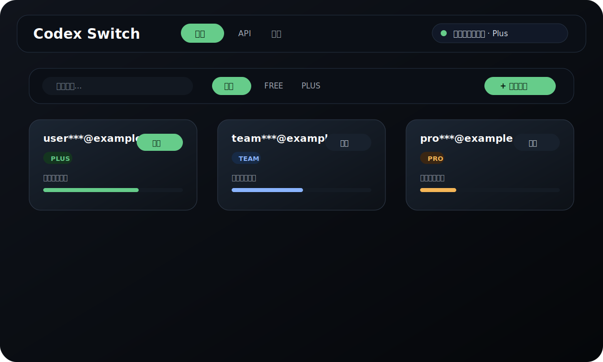
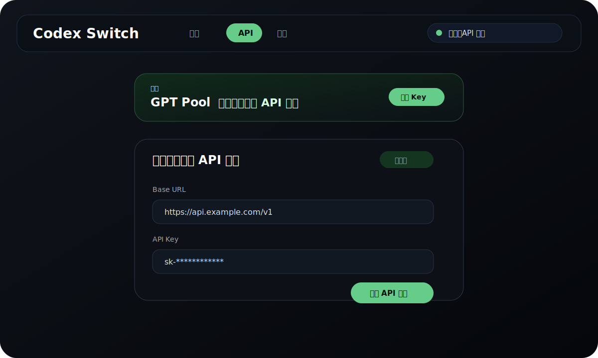
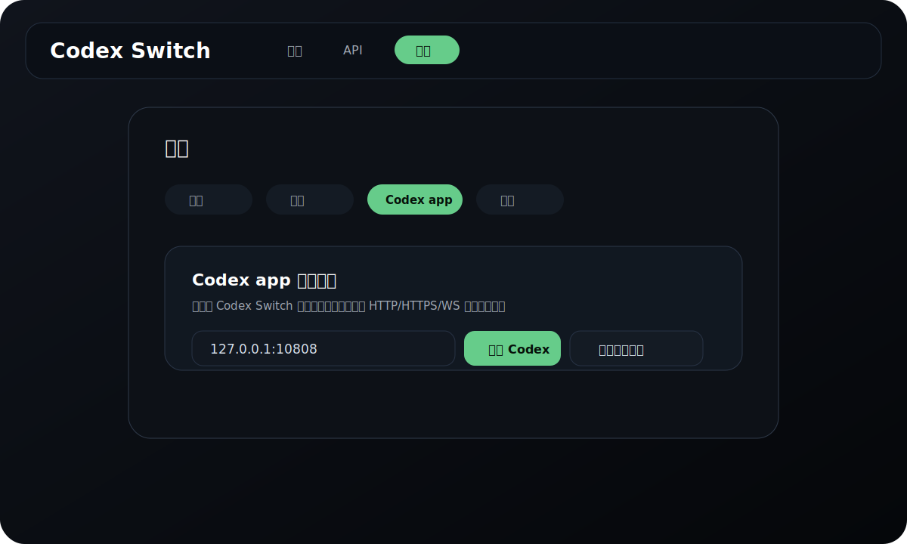

# Codex Switch

Codex Switch 是一个 Windows / macOS 桌面工具，用于管理多个 Codex 账号、切换本机 Codex 登录态，并配置 Codex app 代理启动。

## 截图

> 截图为示意图，不包含真实账号、token 或 API Key。

<p>
  
</p>

<p>
  
</p>

<p>
  
</p>

## 功能

- 管理多个 Codex 订阅账号。
- 读取当前本机 `~/.codex/auth.json` 并保存为账号卡片。
- 通过 OAuth 或 `refresh_token` 导入账号。
- 一键切换订阅账号与 API 模式。
- 保存 OpenAI-compatible API 的 Base URL / API Key。
- 配置 Codex app 启动代理，并用代理环境变量启动 Codex app。
- 检查、下载并安装 GitHub Releases 中的新版本。

## 安装与运行

### 环境要求

- Node.js 22 或更高版本。
- Windows 10/11 或 macOS。
- Rust 工具链。
- Windows 需要 WebView2，macOS 使用系统 WebKit。

### 使用安装包

从 GitHub Releases 下载对应平台安装包，安装后运行即可。

### 从源码启动

```powershell
npm ci
npm run dev
```

项目基于 Tauri 2，复用 React renderer，Rust 侧代码在 `src-tauri/`。

构建安装包：

```powershell
npm run tauri:build
```

### 本地检查

```powershell
npm run check
```

`npm run check` 会执行 JavaScript 语法检查、开源敏感信息基础扫描，并构建 renderer。

安装 Rust 后可以额外运行：

```powershell
npm run check:tauri
```

`check:tauri` 使用系统临时目录作为 Cargo target，避免在仓库内生成大型 `src-tauri/target`。Windows 如遇 MSVC linker 错误，请在 Visual Studio Developer PowerShell 中运行。

### 开发脚本

| 命令 | 用途 |
| --- | --- |
| `npm run dev` | 启动 Tauri 开发模式。 |
| `npm run dev:renderer` | 只启动 Vite renderer。 |
| `npm run build:renderer` | 构建 React renderer。 |
| `npm run check` | 执行 JavaScript 语法检查、开源敏感信息基础扫描，并构建 renderer。 |
| `npm run check:tauri` | 对 `src-tauri/Cargo.toml` 执行 `cargo check`。 |
| `npm run dist` | 构建安装包。 |

### 构建安装包

```powershell
npm run dist
```

构建产物输出到 `src-tauri/target/release/bundle/`，该目录默认不入库。

## 使用说明

### 账号模式

1. 点击“添加账号”。
2. 选择 OAuth 自动登录，或展开 `Refresh Token 导入`。
3. 导入后账号会出现在账号列表中。
4. 点击账号卡片的切换按钮，写入本机 Codex 登录态。
5. 如果切换时检测到 Codex / VS Code 已打开，应用会提示是否重启相关窗口。

### API 模式

1. 打开顶部 `API` 页面。
2. 填写 Base URL，例如 `https://api.example.com/v1`。
3. 填写 API Key。
4. 点击“应用 API 模式”。

API 模式会写入最小可用 Codex 配置：

- `~/.codex/auth.json`：`auth_mode = apikey` 对应的 API Key。
- `~/.codex/config.toml`：`model_provider = "api"`。
- `~/.codex/config.toml`：`[model_providers.api]` 的 `name`、`base_url`、`requires_openai_auth`。

切回订阅账号时，会删除 API 模式相关配置，并恢复文件凭据存储。

### Codex app 代理

1. 打开 `设置 -> Codex app`。
2. 填写代理地址，例如 `127.0.0.1:10808` 或 `http://127.0.0.1:10808`。
3. 点击“启动 Codex”，或创建桌面图标后从该图标启动。

代理地址为空时，“创建桌面图标”会创建不注入代理环境变量的普通 Codex 启动图标；代理地址非空时会创建代理启动图标。

点击“启动 Codex”时，应用会先检查代理端口是否监听，再带 `HTTP_PROXY` / `HTTPS_PROXY` / `ALL_PROXY` / `WS_PROXY` / `WSS_PROXY` 等环境变量启动 Codex app。这个代理只影响由本工具或其创建的桌面图标启动的 Codex app 进程，不会修改系统全局代理；是否走代理取决于 Codex app 对这些环境变量的使用，并会检查 Codex app 是否连接到该代理端口。

如果已经保存 API 模式的 Base URL，代理启动时会同时传递 `OPENAI_BASE_URL`；否则只注入 proxy env，不改 API 站点。

### 在线更新

Tauri 版本的在线更新基于 `tauri-plugin-updater` 和 GitHub Releases。

- Windows 安装包目标：`nsis`，GitHub Release 只发布 `.exe` 安装器
- macOS 安装包目标：Tauri 默认 macOS bundle
- 发布 Workflow：`.github/workflows/release.yml`
- 触发方式：推送 `vX.Y.Z` tag 或手动运行 Workflow
- 更新索引：GitHub Release 中的 `latest.json`
- 更新签名：Tauri updater 签名 key，公钥写在 `src-tauri/tauri.conf.json`

发布示例：

```powershell
git tag v4.9.1
git push origin v4.9.1
```

GitHub Actions 会构建 Windows / macOS 安装包并发布到 GitHub Releases。应用内“检查更新”会读取 Releases 中的 `latest.json`，发现新版本后支持下载并重启安装。

`release.yml` 会显式上传 updater `latest.json`；Windows 侧通过 `src-tauri/tauri.windows.conf.json` 限定只构建 NSIS `.exe`，macOS 侧继续由 `macos-latest` runner 构建默认 macOS 安装包。首次迁移到 Tauri updater 后，需要至少发布一次由该 Workflow 生成的 Release，`src-tauri/tauri.conf.json` 中的 GitHub Releases endpoint 才会返回可用的 `latest.json`。

发布前需要在 GitHub 仓库配置 Secret：

- `TAURI_SIGNING_PRIVATE_KEY`：Tauri updater 私钥内容。
- `TAURI_SIGNING_PRIVATE_KEY_PASSWORD`：私钥密码；如果生成私钥时未设置密码，可以留空或不配置。

私钥不要提交到仓库。fork 后如果要发布自己的安装包，建议重新生成 updater key，并同步替换 `src-tauri/tauri.conf.json` 中的公钥与 updater `endpoints`。

## 数据位置与隐私

- 账号数据：`%APPDATA%/codex-switch/accounts.json`
- 应用设置：`%APPDATA%/codex-switch/settings.json`
- Codex 配置：`~/.codex/auth.json`、`~/.codex/config.toml`
- 代理启动日志：`~/.codex/launcher/codex-proxy-launcher.log`

账号数据中会包含本机 Codex 登录 token。不要把 `%APPDATA%/codex-switch` 或 `~/.codex` 下的敏感文件提交到公开仓库。

## 开源说明

- License：MIT
- 默认使用 GitHub Releases 做更新源。
- 如果 fork 后发布自己的版本，请修改 `package.json` 中的 `repository.url`，并使用自己的 GitHub Releases。
- `API` 页面包含一个 `gpt-pool.com` 广告入口；如果你的发行版不需要该入口，可以自行删除或替换。
- 贡献前请阅读 `CONTRIBUTING.md`。PR 至少应通过 `npm run check`、`npm run check:tauri`、`cargo fmt --check`、`cargo test` 与 `cargo clippy -- -D warnings`。

## CI

仓库包含两个 GitHub Actions Workflow：

- `.github/workflows/ci.yml`：在 Pull Request、`main` 分支 push 和手动触发时运行基础检查。
- `.github/workflows/release.yml`：在 `vX.Y.Z` tag 或手动触发时构建并发布安装包。

CI 使用 Node.js 22、Rust stable 和 npm lockfile 安装依赖。Windows / macOS Tauri 构建依赖 GitHub-hosted runner 的系统 WebView 与平台 SDK；本地构建失败时，请优先确认本机 Rust、MSVC 或 Xcode Command Line Tools 是否安装完整。

## 注意

- 开发模式不支持在线更新测试，请使用安装版验证更新流程。
- 当前构建默认未做代码签名，Windows 可能提示 SmartScreen。
