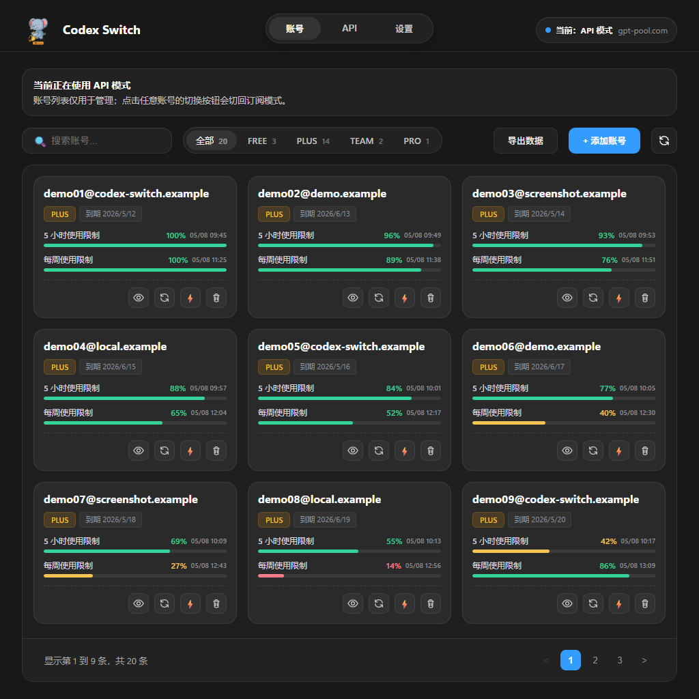

# Codex Switch

[English](./README.en.md)

Codex Switch 是一个本地桌面工具：管理多个 Codex 订阅账号，并在订阅账号和 OpenAI-compatible API 模式之间一键切换。支持 Windows 和 macOS。



## 下载

从 [GitHub Releases](https://github.com/wen495033653/codex-switch/releases) 下载最新版本，之后可以在应用内更新。发布签名说明见 [Code signing policy](./CODE_SIGNING.md)。

## 功能

- **账号管理**：通过 OAuth、`refresh_token` 或 JSON 文件添加账号；查看额度、订阅到期时间和刷新时间；支持定时刷新、导入导出。
- **API 模式**：保存多套 OpenAI-compatible API 配置，Base URL 自动规范化，可一键测试连通性，与订阅账号一键互切。
- **会话同步**：订阅模式和 API 模式共用同一份会话列表，切换后仍能继续原来的会话。
- **会话管理**：浏览和预览本机会话，归档、删除（可恢复）、导入和导出。
- **用量统计**：按账号和 API 配置统计 token 用量，并估算费用。
- **Codex 代理**：为 Codex app 配置本地 HTTP/HTTPS 代理，关闭后自动清理配置。
- **其他**：应用内更新、浅色/深色主题、中英文界面、开机启动、赞助入口。

所有账号数据和设置都只保存在本机。

## 参与开发

项目基于 Tauri 2 + React + Rust。

```bash
npm ci
npm run dev
```

环境要求、项目结构和提交流程见 [CONTRIBUTING.md](./CONTRIBUTING.md)。欢迎提交 Issue 和 PR。

## License

[MIT](./LICENSE)
